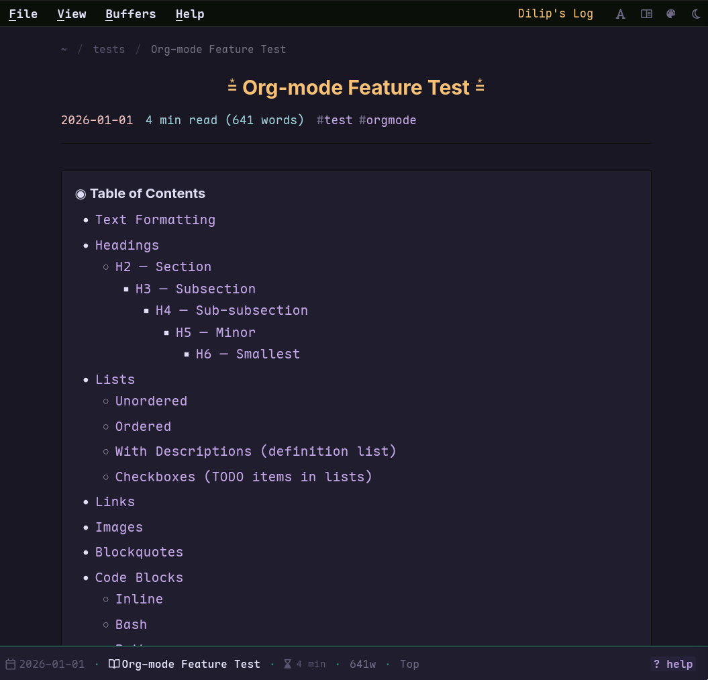
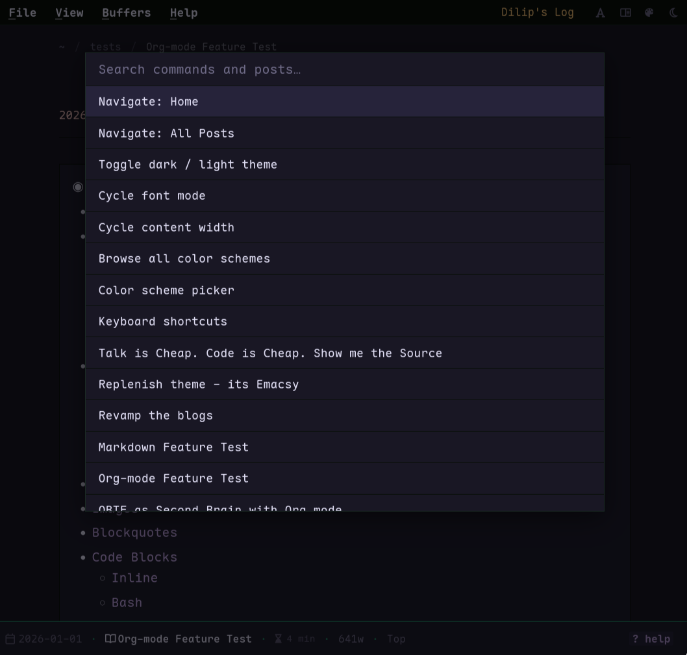
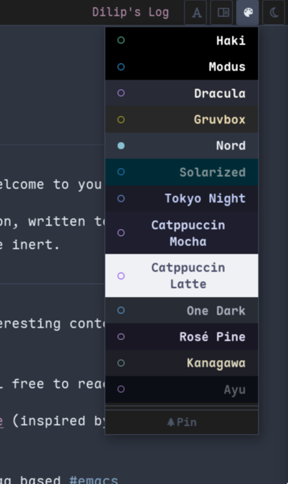

# Emacs Hugo Theme

A Hugo theme that transforms your blog into an Emacs-like experience — buffer UI, modeline, echo area, keyboard navigation, and a full color scheme system.

Eg: https://idlip.in







## Features

- **Buffer UI** — article list (Dired-style) and post content displayed as Emacs buffers
- **Emacs modeline** — buffer name, word count, scroll position, read time
- **Command palette** — `x` to open; search posts, run commands, browse 300+ color schemes
- **Base16 color system** — 11 preset schemes + all 305 tinted-theming schemes via palette
- **Random scheme per session** — different accent colors on every page load, with pin to lock
- **Font cycling** — mono → sans → serif → mixed (`f` key)
- **Content width cycling** — 100% / 80ch / 60ch / 840px (`w` key)
- **Keyboard navigation** — full keybindings for list and post pages
- **Echo area** — shows key hints and transient messages
- **Mobile responsive** — single-buffer layout on small screens

## Installation

```bash
cd your-hugo-site
git submodule add https://github.com/idlip/hugo-emacs-theme themes/emacs
```

`config.toml`:

```toml
theme = "emacs"

[markup.highlight]
noClasses = false
```

## Keyboard Shortcuts

### Global

| Key           | Action                        |
|---------------|-------------------------------|
| `x`           | Open command palette          |
| `t` / `i`     | Toggle dark / light theme     |
| `f`           | Cycle font mode               |
| `w`           | Cycle content width           |
| `c`           | Open color scheme picker      |
| `?`           | Show keyboard help            |
| `C-g` / `Esc` | Cancel / close                |
| `+` / `-`     | Increase / decrease font size |

### List page

| Key                   | Action               |
|-----------------------|----------------------|
| `n` / `↓`             | Next article         |
| `p` / `↑`             | Previous article     |
| `RET` / `o` / `Space` | Open article         |
| `<` / `>`             | First / last article |
| `g g`                 | Top of list          |
| `g G`                 | Bottom of list       |
| `g h`                 | Go to home           |
| `g p`                 | Go to posts          |

### Post page

| Key                 | Action               |
|---------------------|----------------------|
| `n` / `p`           | Next / previous post |
| `↓` / `↑`           | Scroll down / up     |
| `Space` / `S-Space` | Page down / up       |
| `C-v` / `M-v`       | Page down / up       |
| `q`                 | Back to list         |

### Command palette

| Key                        | Action                              |
|----------------------------|-------------------------------------|
| Type to filter             | Search commands and posts           |
| `t ` (t-space)             | Browse all 305 base16 color schemes |
| `↑` / `↓` or `C-p` / `C-n` | Navigate items                      |
| `RET`                      | Execute / select                    |
| `Backspace` on `t `        | Return to command mode              |
| `Esc`                      | Close palette                       |

## Color Scheme System

### Preset schemes (menu bar picker)

11 built-in base16 schemes selectable from the `󰏘` button or `c` key. Hover previews the scheme live; click applies and persists.

### Full tinted-theming library (command palette)

Open the palette (`x`), type `t ` to enter scheme mode. All 305 schemes from the [tinted-theming/schemes](https://github.com/tinted-theming/schemes) collection are available with live arrow-key preview. Selected scheme is persisted to `localStorage` and restored before first paint (no flash).

### Random scheme

A random scheme is applied on every page load unless pinned. Use the pin button in the scheme popup to lock the current scheme across sessions.

## Changes from upstream fork

The following features were added or replaced after forking from [hugo-emacs-theme](https://github.com/ArthurHeymans/hugo-emacs-theme):

| Area                     | Change                                                                               |
|--------------------------|--------------------------------------------------------------------------------------|
| **Command palette**      | New — `x` key opens native `<dialog>` palette with post search + commands            |
| **Color schemes**        | Replaced Modus-only with full base16 system (11 presets + 305 via tinted-theming)    |
| **Random scheme**        | New — random base16 scheme per session with localStorage pin                         |
| **Custom palette**       | New — palette picker persists chosen scheme; restored before paint via inline script |
| **Font cycling**         | New — mono/sans/serif/mixed via `f` key and `data-font` attribute                    |
| **Width cycling**        | New — four content widths via `w` key                                                |
| **Post navigation**      | `n`/`p` navigate prev/next post on post pages                                        |
| **`g`-prefix sequences** | New — `gg`, `gG`, `gh`, `gp` sequences                                               |
| **Echo area button**     | Styled as highlighted pill; flashes on messages                                      |
| **CSS**                  | ~1000 lines removed — split-view dead code, duplicate rules, legacy echo styles      |
| **Split-view**           | Removed — `C-x 2/3` window splitting no longer present                               |
| **JS bundle**            | 4 files → 1 deferred bundle (`app.js`, ~19 KB minified)                              |

## File Structure

```
themes/emacs/
├── assets/
│   ├── css/
│   │   ├── echo-area.css    # Command palette + help overlay
│   │   ├── main.css         # Global reset, typography, callouts
│   │   ├── menu-bar.css     # Menu bar and dropdowns
│   │   ├── mobile.css       # Responsive breakpoints
│   │   ├── modeline.css     # Emacs modeline
│   │   ├── schemes.css      # Preset base16 scheme variables
│   │   ├── syntax.css       # Code block highlighting
│   │   ├── themes.css       # Semantic color variables + font/width modes
│   │   └── windows.css      # Buffer frame and article list layout
│   └── js/
│       ├── keyboard.js      # Keyboard navigation and shortcuts
│       ├── menu.js          # Menu bar, scheme picker, font/width cycling
│       ├── palette.js       # Command palette (native <dialog>)
│       └── windows.js       # Buffer scroll sync and modeline updates
├── layouts/
│   ├── _default/
│   │   ├── baseof.html      # Base template (data-theme, data-scheme attrs)
│   │   ├── list.html        # List pages
│   │   ├── single.html      # Post pages
│   │   └── terms.html       # Taxonomy pages
│   └── partials/
│       ├── echo-area.html   # Palette <dialog> + help overlay
│       ├── head.html        # CSS/JS bundles, schemes JSON, restore script
│       ├── menu-bar.html    # Top menu bar
│       ├── modeline.html    # Modeline partial
│       └── post-listing.html# Article list item
└── README.md
```

## Browser Support

Modern browsers (Chrome, Firefox, Safari, Edge). Uses `<dialog>` element, CSS custom properties, `localStorage`, and `fetch` — no polyfills included.

## Credits

- Forked from [hugo-emacs-theme](https://github.com/ArthurHeymans/hugo-emacs-theme) by Arthur Heymans
- Color schemes: [tinted-theming/schemes](https://github.com/tinted-theming/schemes) (base16 spec)
- Inspired by GNU Emacs

## License

Dual-licensed under [MIT](LICENSE) or [Apache 2.0](LICENSE), at your option.
